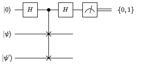
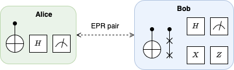
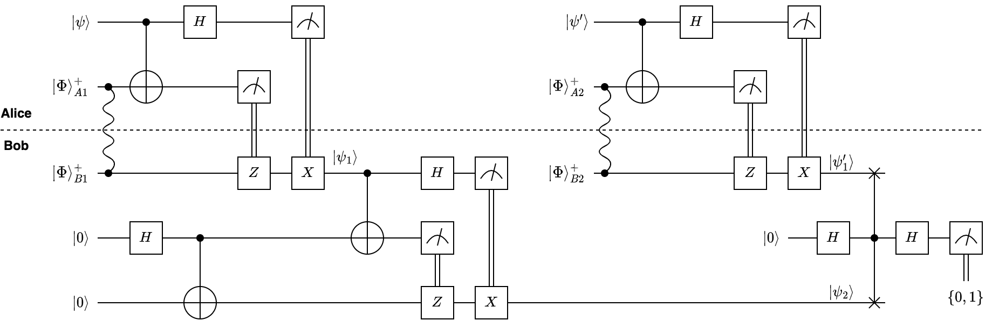
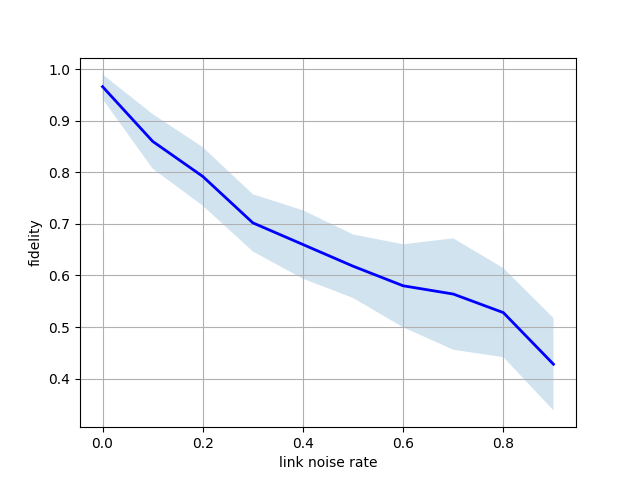

# qperf

A quantum link performance measurement tool.

## Motivation

The Quantum Internet of the future will offer its users end-to-end entanglement of qubits to enable a whole ecosystem of distributed quantum applications.

As envisioned by the scientific community, the operation of the Quantum Internet will rely quantum routing protocols at the link and network layers, which in turn requires (or can greatly benefit from) knowledge on the quality between a physical/virtual link.

Such information is very often assumed to be available _a priori_ based on the exact knowledge of the infrastructure (e.g., fibre optic cable lenght and quality) and datasheet parameters of the network components involved (e.g., quantum repeaters).

However, there is no guarantee that such information will be actually available to the quantum routing protocol in practice for a number of reasons:

- operational performance of components can deviate from datasheet figures because of installation errors or environmental conditions;
- in the case of virtual links, i.e., multiple physical links providing end-to-end entanglement through quantum repeaters, the parameters of some components may be unavailable (e.g., hidden by the owner of the components);
- the infrastructure can be dynamic, e.g., passive optical switching can change the length of the path between any two nodes.

Therefore, a tool will be needed to measure the performance of a physical (or virtual) link, to be i) integrated with the quantum routing protocols to optimise path selection/provisioning, or ii) used by the application layer to determine whether the connection quality is sufficient.

To this purpose, we propose `qperf`, whose name is inspired from the tool [iperf](https://iperf.fr/), which is widely used by (classical) Internet users to measure the end-to-end TCP/UDP performance between any two hosts.

## Realization

We propose to realize quantum link performance measurement between two end nodes Alice and Bob using the [swap test](https://en.wikipedia.org/wiki/Swap_test), which is a known technique to estimate the squared inner product between two states, $|\langle \psi,\psi'\rangle|^2$, by measuring an ancilla used as the control qubit of a [Fredkin gate](https://en.wikipedia.org/wiki/Fredkin_gate):



The two states $|\psi\rangle$ and $|\psi'\rangle$ are prepared as the same state by Alice and the teleported one after another to Bob, which performs the swap test.

The procedure requires that:

- end-to-end entangled EPR pairs can be generated between Alice and Bob;
- Bob has two local qubits (one is used to keep the teleported state, the other as the ancilla of the Fredkin gate);
- Alice can generate a local qubit initialized at a known state;
- the following gates are supported by the two parties:
  - Alice: H, CNOT;
  - Bob: H, X, Z, Fredkin (c-SWAP).



The overall circuit is shown below:



where:

- $|\Phi\rangle^+_{A1},|\Phi\rangle^+_{B1}$ and $|\Phi\rangle^+_{A2},|\Phi\rangle^+_{B2}$ are the EPR pairs generated between Alice and Bob;
- $|\psi\rangle$ is the first state produced by Alice;
- $|\psi_1\rangle$ is the version of the latter teleported from Alice to Bob;
- $|\psi_2\rangle$ is the version of the latter teleported into a local qubit at Bob;
- $|\psi'\rangle$ is the second state produced by Alice;
- $|\psi'_1\rangle$ is the version of the latter teleported from Alice to Bob.

The quality estimation is done between $|\psi_2\rangle$ and $|\psi'_1\rangle$.

## Source code

A reference implementation of `qperf` is provided using [SquidASM](https://github.com/QuTech-Delft/squidasm):

- the `SenderProgram` implements Alice's logic by continuosly preparing a know state $|\psi\rangle$ and teleporting it to its peer;
- the `ReceiverProgram` implements Bob's logic, which consists of two stages:
  - first stage: teleporting the state received from the peer to a local qubit;
  - second stage: performing a swap state, which produces a classical bit {0,1}

The procedure must be repeated several times to produce accurate results.

Theoretically, the quality can be estimated with $\varepsilon$ error by taking $\mathcal{0}\left(\frac{1}{\varepsilon^2}\right)$ samples, but non-linear impairments in practice may negatively affect convergence of the estimation process. This is an open area for investigation.

The implementation assumes that Alice and Bob use NV qdevices, with ideal operation parameters, and they are connected through a link with configurable depolarisation, whose noise figure in the Python script is swept between 0 and 1.

Furthermore, we run multiple independent replications of the same experiment and compute the standard deviation of the measurements from each replication.

## Example execution

After installing SquidASM, a `qperf` batch of experiments can be executed with, e.g.,:

```bash
python experiments/qperf.py --num-experiments 10 --num-samples 100 --output out.dat --plot
```

which runs 10 experiments, each consisting of 100 measurements, for 10 possible values of the link noise, so the total number of swap tests is 10,000 (20,000 EPR pairs generated). On a 5-code VM the execution took about 30 minutes and produced the following output (raw data in `out.dat`)



```
0.000000 0.966000 0.023749
0.100000 0.860000 0.052915
0.200000 0.792000 0.056710
0.300000 0.702000 0.055462
0.400000 0.660000 0.066332
0.500000 0.618000 0.061612
0.600000 0.580000 0.080498
0.700000 0.564000 0.108000
0.800000 0.528000 0.086348
0.900000 0.428000 0.089532
```

## Installation

Tested on a clean Ubuntu 22.04 (_use real credentials instead of `user1234`/`password1234` obtained from the [netsquid forum](https://forum.netsquid.org/ucp.php?mode=register)_):

```bash
export NETSQUIDPYPI_USER=user1234
export NETSQUIDPYPI_PWD=password1234
sudo apt update && sudo apt install -y python3-virtualenv
git clone https://github.com/ccicconetti/qperf.git
cd qperf
thirdparty/setup.sh
source .venv/bin/activate
python experiments/qperf.py --help
```

With [multipass](https://multipass.run/) you can create a clean Ubuntu 22.04 virtual machine, with 5 CPU cores and 8 GB of RAM, called `squidasm` with the following command:

```bash
sudo multipass launch -c 5 -m 8G -n squidasm 22.04
```

Then, you can enter the VM with:

```bash
sudo multipass shell squidasm
```

## Credits

The repository was developed by [@ccicconetti](https://github.com/ccicconetti), researcher at [IIT-CNR](https://www.iit.cnr.it/en), as part of the research activities in the project [NQSTI](https://www.nqsti.it/) funded within the [National Recovery and Resilience Plan](https://www.italiadomani.gov.it/content/sogei-ng/it/en/home.html) Italian initiative.
